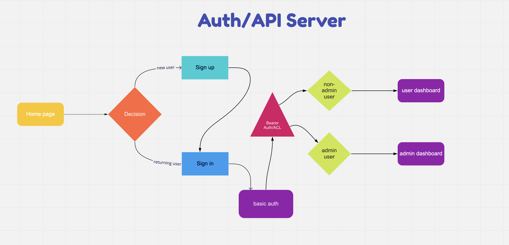

# auth-module-final-project

## Authors

- Jarrell Houston
- Brendan Smith
- Dan Engel

### Project Links

- [GitHub Test Report](https://github.com/brendigler/auth-module-final-project/actions/runs/804965119)
- [Deployed Site](https://dan-brendan-jarrell-authmodule.herokuapp.com)

### Description

This site demonstrates a signup/signin auth API server. User signup is saved to a MongoDB. We utilize basic auth for signin and bearer auth/ACL for access and token/cookie verification.

### Setup

`.env` requirements
- PORT - 3333
- SECRET - secretsauce

### Running the App

- npm run start

### Tests

- npm run test

### UML

